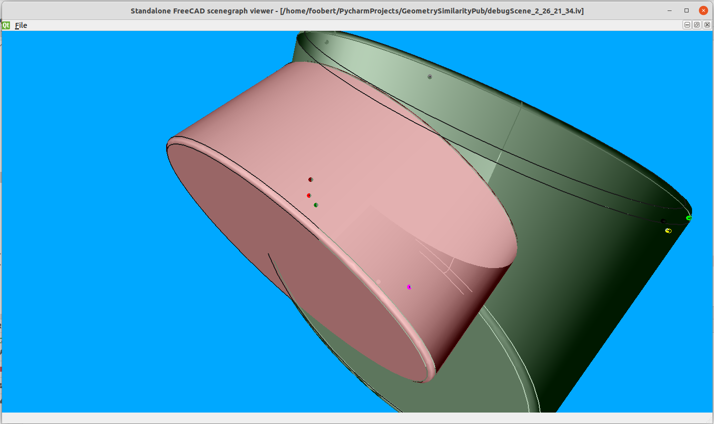
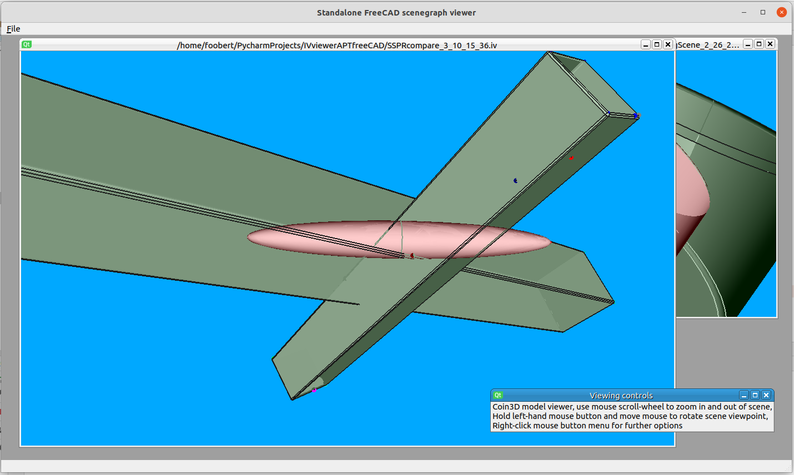

# shapematch

**shapematch** identifies similar 3D CAD geometry shapes that have been rotated, translated or scaled, returning a measure of similarity. A set of consistent affine-invariant feature points are extracted from CAD surfaces for comparison.

Humans can look at a scene and immediately recognise moved or similar objects, computers cannot. Surprisingly, there is no obvious method to identify similarity between numerical abstract representations of geometry. 
This has real world ramifications, one [example](http://web.archive.org/web/20230309122240/https://www.brookings.edu/techstream/understanding-the-errors-introduced-by-military-ai-applications/) is a semi-autonomous missile defence system incorrectly classifying a friendly military jet as an enemy missile.

A Computer Aided Design representation of a component cannot be immediately identified as a transformed representation of another identical component. The transformations in question are scaling, rotation, and translation, a rigid affine transform. 

There is no universal representation of objects within abstract numerical systems that allows comparison of these geometric representations between different systems. 
As a result, there is no reliable method to test similar shapes represented in different CAD applications. The method used here was devised to support machine shape comparison, in turn allowing automated testing and mapping of CAD API functionality between different CAD systems.

## Motivation

Modern parametric feature CAD systems enable designers to create shape geometries from a set of ordered geometry concepts or features.   
These features might be something like a hole or a reference plane, each of which are defined relative to one another with a set of parameters that specify their form. 
The main advantage of defining an object as a structured collection of features is that it allows the geometry to be automatically recreated once any of these feature parameters are modified. 
Before this innovation, the surface of a CAD would have to be edited to accommodate changes of design features. 
While these systems represent labour-saving innovation, there is no universal definition of parametric geometric features and their associated parameters. 
This has meant that designs are not readily moved between different commercial systems, a surface model may be transferred but much of the parametric feature definition that gives these models their utility is lost. 

It is possible to take a surface model, and attempt to guess the associated parametric features used by a particular CAD software to recreate the same surface. 
This approach requires significant labour in identifying and mapping individual CAD features as commercial systems typically have hundreds of API functions dealing with their feature representations. 
Another strategy is to attempt to create a mapping between parametric features within different systems, so that the set of API function calls to generate and modify the features of a models could be mapped to a set of API calls in a different CAD system which would still generate a geometric model with an identical surface. 
Mapping the similarity between CAD API function calls to model parametric features and their derived surface geometry would be more economic and feasible if the process could be automated to some extent.   
The barrier to automating this process is the ease with which one surface geometry in one CAD system can be tested with a comparable surface geometry in a second CAD system. 
If the similarity between surface geometries represented within heterogeneous CAD systems could be determined through a universal algorithm, the task of mapping CAD feature API might be partially or fully automated.   

This proof-of-concept package demonstrates and tests an approach to measuring the similarity between CAD surface geometries, independent of model orientation, position or scale. 
It can be shown that the method may be extended to determine a numerical similarity value between all affine transformations of surface boundary objects. 
FreeCAD is chosen because of its open code base, active community and convenient Python interfaces. It also allows cheaper reproduction of results than the use of commerical CAD products.

The research also demonstrated a Genetic Algorithm using this geometry similarity test to map parameters between select feature geometry API, see published documentation. 
The numerical similarity value between API generated shape models is used as the fitness function to minimise.


### Feature Point Representation for geometry comparison

The important concepts of this project were to firstly test a *minimal set of features that could identify geometric similarity between 3D shapes*, allowing reliable identification despite rotation, translation and scaling. 

The second requirement was to determine a *minimal routine for identifying these feature points*, to extract these points with a minimum knowledge of any particular CAD system.

If unique ordered feature points can be assigned to an object surface geometry, then SVD transformation will enable rapid and reliable mapping between objects with similar point sets, independent of the CAD environment. This minimal method relies on Cartensian points returned from a point projection to the boundary surfaces of the model undergoing testing.

An example of a geometry feature is a corner, represented by the maximum local displacement from a local geometric centroid of the shape. This corner feature can be found from an iterative hill-searching algorithm, converging on the furthest point relative to a centroid using only the intersections of centroid projections to the boundary surface.

Extending this simple routine, there are local minima, then radially symmetric features (e.g. the ends of cylinders), which can be also subdivided into maxima such as a ridge represented by a point at the feature centre, and minima feature, such as the centre of an hourglass. Finally, spheres have their own central point. With these 5 distinguishing features, unique feature point representations have been created from all surface geometries tested.


*Geometric surface showing feature points, ordered from top to bottom as,*
- *yellow: feature maxima centre,* 
- *magenta:feature minima point,*
- *green: feature minima centre,*
- *orange: sphere centre,*
- *green: feature minima centre,*
- *blue: feature maxima centre*


Increasing geometric complexity of a shape provides a more unique model representation, with more individual feature points and consequently a more reliable comparison. This is convenient as it allows a limited model set to test the applicability of the method. The original research used the primitive shape benchmark library published by the US National Design Repository to allow direct comparison with other techniques (see below).

The points in this feature point representation are preserved through object rotation, translation and uniform scaling operations. A unique helical ordering of these points allows the rotational matrix and translation vector to be derived from a Singular Value Decomposition operation, this represents a significant improvement in accuracy and speed over comparable techniques. 


*Find the most unique point, create an axis from this point to the centroid, then organise all other points in a spiral around this axis.*

An SVD decomposition of feature points in a source object and a target object returns a rotation and translation transform. By recording the deviation of points sampled from the source surface and transformed to the target surface, it is possible to generate an accurate statistical probability of shape similarity.


*Transform random source points (stars) to target model, and test deviation from model surface.*

As the displacement of feature points from the local model centroid are preserved under scaling, rotation and translation (footnote affine transformation also includes shearing along various axes, and extra processing step), these values can be formed into a histogram to make rapid comparison with similar histograms of other geometries. These feature points are further ordered by type, whether representing surface maxima, surface minima, centrepoints of rotationally-symmetric features or spheres.


*Shape matching algorithm*

Further details available at,

## Documentation

[Borland, T.D., 2019. An automated method mapping parametric features between computer aided design software (Doctoral dissertation, Brunel University London).](https://bura.brunel.ac.uk/bitstream/2438/19184/1/FulltextThesis.pdf)

## Installation

This version uses the open-source [FreeCAD](https://wiki.freecad.org/Download) 3D computer aided design geometry engine, alongside the 3D graphics libraries used with the software (PySide2, pivy, coin). 
Under Microsoft Windows, the FreeCAD directory is presumed to be,

    C:\Program Files\FreeCAD*\

Under Debian, Ubuntu Linux, 

    /usr/lib/freecad

**shapeMatch** has been tested with Ubuntu 20.04.5 LTS & FreeCAD 0.20.2, the most trouble-free installation is via Debian Advanced Package Tool, which also allows installation of a compatible pivy library. To install from a bash shell, 

```bash
$ sudo apt-get update
$ sudo apt-get install freecad
$ sudo apt-get install python3-pivy
```

See [official FreeCAD docs](https://wiki.freecad.org/Installing_on_Linux)

[See also Pivy 0.6.5 requirement](https://pkgs.org/download/python3-pivy)

The AppImage squashfs package also tested, but requires that the package is unpacked and pathnames set. 
Ubuntu snaps FreeCAD 0.20.2 installation does not load local Python site-packages or FreeCAD python objects.
The directory location of FreeCAD python interfaces and local site-packages is added to the python PATH environment variable. 
Libraries required for Open Inventor visual display are installed within the FreeCAD installation, use PySide2 rather than PyQt5 with FreeCAD 0.20.


Clone the project to a local directory to repeat tests using the NIST/Drexel CAD STEP data

```bash
$ git clone https://github.com/USERNAME/shapematch
```

### Library installation

The universal Python PyPI package index only lists an outdated version of the python coin3D binding, **pivy 0.3.0**. 
FreeCAD and the FreeCAD Graphic User Interface is sensitive to library versions used in compilation, PySide2, PyQt, Pivy.
While a virtual environment would be the ideal approach, Pipenv is unsuited to a distribution mixing Python and version-sensitive C++ libraries.  
Anaconda/conda provides a suitable distribution environment but does not host stable distributions at the time of writing. 


The Python environment path is updated in Windows to reflect the default path of the FreeCAD binary files and associated graphics libraries.
```python
FreeCADPATH = r"C:\Program Files\FreeCAD*\bin"
```

Under Ubuntu, the default system-wide installation functions correctly (tested Ubuntu 20.04.5 LTS with FreeCAD 0.20.2, Python 3.8)

```python
FreeCADPATH = r"/usr/lib/freecad/bin"
PythonPackagePATH = r"/usr/lib/freecad-python3/lib"
```

The [AppImage](https://github.com/FreeCAD/FreeCAD-Bundle/releases/tag/0.20.2) version tested also works when installed with the AppImageLauncher package and the squashfs filesystem is extracted.  
(FreeCAD_0.20.2-2022-12-27-conda-Linux-x86_64-py310_529d628153ed2b233333ba5cef519383.AppImage)

```python
FreeCADPATH = r"/home/LOCAL_USER/Applications/FreeCAD_SQUASHFS_ROOT/usr/bin"
PythonPackagePATH = r"/home/LOCAL_USER/Applications/FreeCAD_SQUASHFS_ROOT/usr/lib/python3.1/site-packages"
```

## Usage

The shapeMatch package can be run from a terminal command line, two functions are available,

```bash
$ python -m shapematch singlePRtest -I /path/to/shape/STEP/files
```

**singletest** selects three STEP CAD files, all rotated, scaled and positioned at random. The designated negative model is a different shape than the source and positive model. 

Each of these three CAD models are converted to feature point representations, so that a similarity comparison of the source model against the positive and negative models can be tested. The feature point object files are saved, as are the comparison metrics. The FreeCAD geometry engine is invoked through an external python interface rather than the script running within the internal FreeCAD python scripting interpreter.

The command line has options to provide the path to the output directory where the generated feature point representations are saved (**-O**), the input directory containing the STEP models (**-I**), alternatively, the paths to specified source, negative and positive STEP files may be individually specified (**-sf**, **-nf**, **-pf**). Comparison metrics are saved as a comma-seperated value file, if a file already exists it is updated. The CSV file name may be optionally specified (**-of**). 

The topographic schema uses simple feature points such as the centre of radially symmetric features and the local extrema relative to the shape centroid. The process of locating these points can be followed (and debugged) from a 3D CAD representation saved as an Open Inventor scenegraph file. This file is created with the **-s2** flag. A scenegraph file of the source, positive and negative files under comparison may be saved wth the **-s** flag.

Each operation of the **singletest** creates three feature point representation objects corresponding to the source, positive and negative STEP files used. Once a number of these object feature point representations have been created and saved as files, they may be used to demonstrate the speed and accuracy of similarity matching using this representation.


```bash
$ python -m shapematch multitest -I /path/to/shape/object/files
```

**multitest** performs a similarity comparison over all feature point representation models within a specified input directory (**-I**). This process generates a CSV output file which may be explicitly named (**-of**), and a python object file containing similar data, which may be saved with a custom filename following the **-obf** flag. Both command functions have a verbose flag (**-v**) which displays detailed operational information.

### Visualisation

A stand-alone program **iv_viewer.py** is provided to allow viewing of created scenegraph files without recourse to the FreeCAD program, (IV scenegraphs of model surfaces are not displaying within FreeCAD for indetermined reasons)

```bash
$ python -m iv_viewer -I /path/to/scenegraph/file
```

### CAD source data 

The NIST/Drexel CAD primitive shape benchmark library was used in the published research attached to these routines as it was designed for shape matching algorithm testing, enabling direct comparison against other published methods. Unfortunately this Primitive Models Classification archive disappeared from its hosted site at 

http://web.archive.org/web/20181105065515/http://edge.cs.drexel.edu/repository/

https://www.nist.gov/publications/nist-design-repository-project-project-overview-and-implementation-design

It is supplied for reference within the local */data/primitives* subfolder, under the [NIST license](https://www.nist.gov/open/copyright-fair-use-and-licensing-statements-srd-data-software-and-technical-series-publications#software)

https://github.com/usnistgov/engineering-design-models/blob/master/LICENSE.md

https://github.com/usnistgov/engineering-design-models

A number of other CAD libraries exist for similar benchmark comparative purposes, e.g.

https://www.nist.gov/publications/repository-design-process-planning-and-assembly

https://github.com/bharadwaj-manda/CADNET-Dataset

FreeCAD, the CAD program used, will import a wide variety of CAD models. The only requirement is that a point projected to the imported geometry will register an intersection. See,

https://wiki.freecad.org/Import_Export

Note that the native STEP CAD format allows rapid extraction of the feature points used in this schema, however the intent of the project was to demonstrate that a minimal set of API features could be used within any CAD program to query any CAD shape, namely the projection 

## Screenshots



*Screenshot showing iv_viewer displaying matching between two similar shapes. The marked points show tests for deviation between transformed random surface points from the source shape, projected to the surface of the target shape.* 



*Representation of a source shape (oblong - green), transformed to a positive similar shape (oblong - green), and a negative dissimilar shape (oblate spheroid - red).*

## Project Status

This code supported doctoral research into automated CAD API mapping. 
It has been ported from the original CAD geometry engine, McNeel Rhinoceros 5.0 which had a convenient COM Rhinoscript interface to an actively maintained FLOSS 3D CAD.

## Contributing

To contribute to **shapematch** create a fork on GitHub. Clone your fork, make some changes, and submit a pull request.

## License

[LGPLv3](https://choosealicense.com/licenses/lgpl-3.0/)

[](https://github.com/psf/black)


